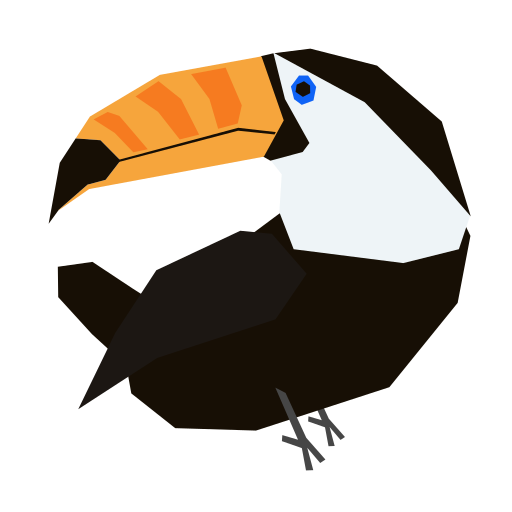

    

# toucant

**toucant** is a demotivational app made with 😭

## Server

The `/server` is completely written in Rust and uses [Axum](https://github.com/tokio-rs/axum) as well as [Serde](https://serde.rs/). 

Deployment is easily done using Docker-Compose with the provided `docker-compose.yml` file, using `docker compose up -d`. The provided Nginx configuration file can be used to reverse proxy the server with correctly set cache headers.

Currently, the only route is `/api/daily` which returns your daily demotivational quote! The server starts on `0.0.0.0:3000`. During development, you can also run `cargo doc --open` to view the documentation. 

Extending the daily demotivational quote catalog is as simple as adding new quotes and quizzes to the `/server/data.json` file.
